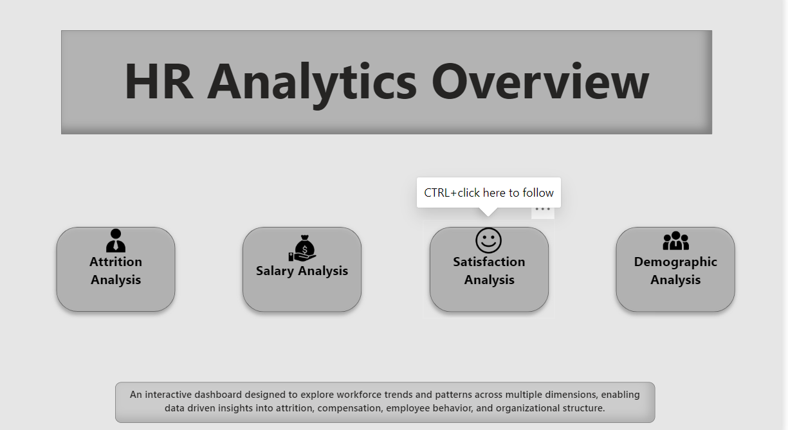
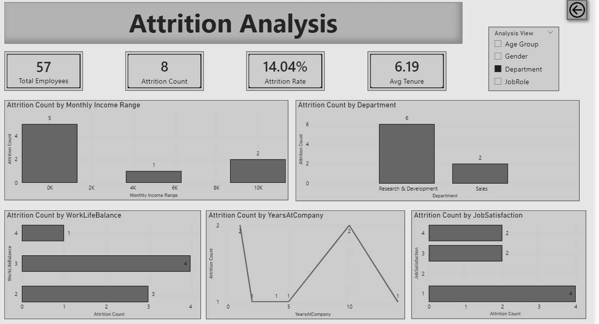
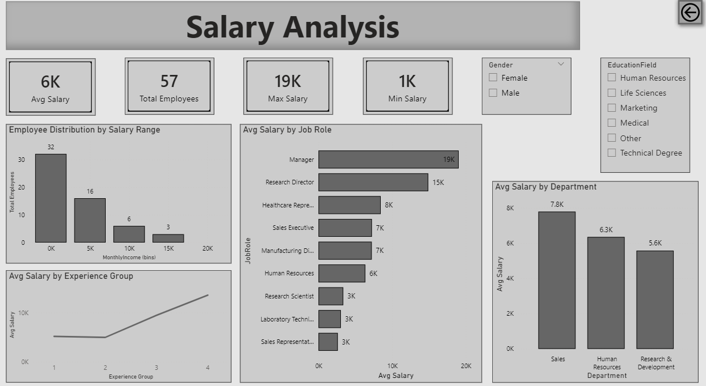
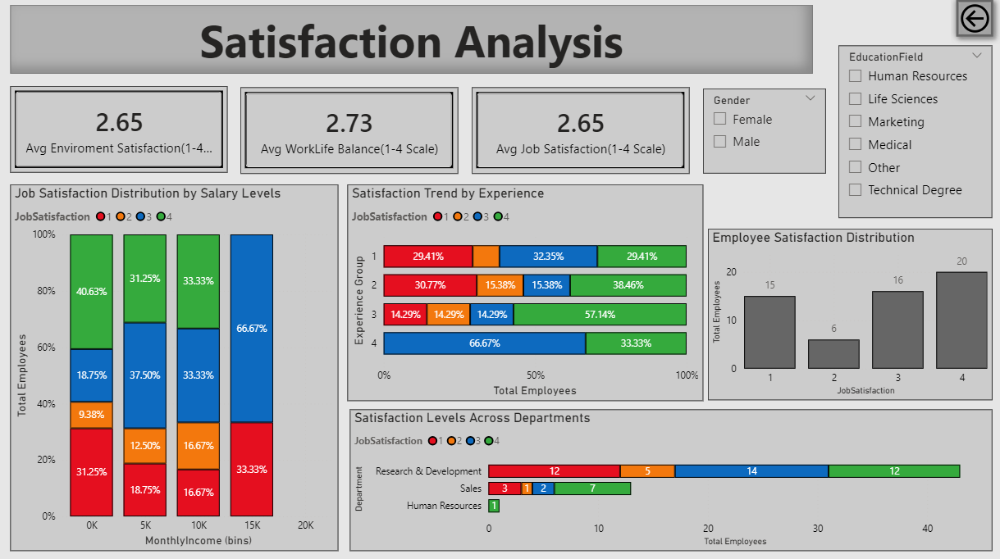
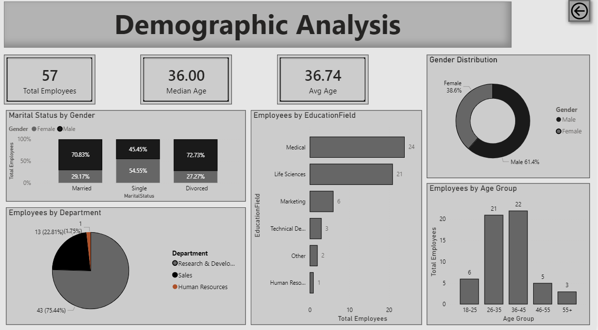

# HR Analytics Power BI Project

## Project Overview
This project is an interactive HR Analytics dashboard built using Power BI.
The dashboard helps analyze employee attrition, salary trends, employee satisfaction, and workforce demographics.

## Dashboard Pages
- Home Page
- Attrition Analysis
- Salary Analysis
- Satisfaction Analysis
- Demographic Analysis

## Key Insights
- Higher attrition was observed among employees with lower job satisfaction and lower monthly income
- Research & Development department Showed higher attition trends
- Employee aged 26-35 experienced comparatively higher attrition
- Manager role recorded the highest average salary across job roles
- Sales department showed higher average salary trends
- Majority of employees were in lower salary ranges
- Employee in higher income ranges showed better job satisfaction levels
- Research & Development department had the highest employee count
- Male employees represented a larger share of the workforce
  
## Tools Used
- Power BI
- Power Query
- DAX
- Data Visualization

## Dataset
HR employee dataset used for dashboard analysis and reporting.

## Screenshots
### Home Page

### Attrition Analysis

### Salary Analysis

### Satisfaction Analysis

### Demographic Analysis

